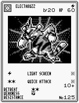
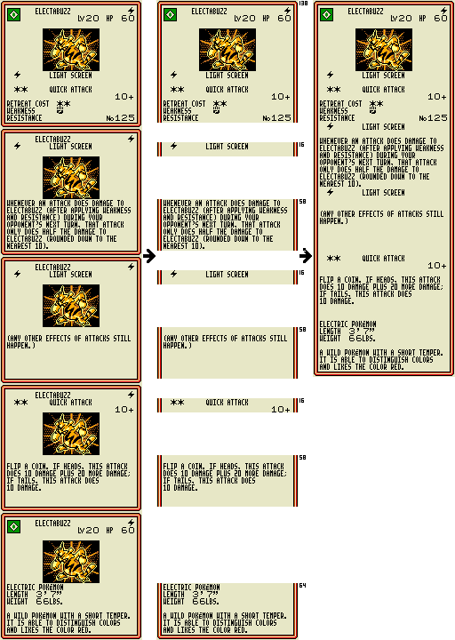

# Pokemon-TCG-Completed-Save-And-Card-Printouts
A completed Pokemon Trading Card Game save file with Lua scripts to screenshot each card and assemble them into nice printouts.

This project is **work in progress**. Currently, it can screenshot every page for every card in the Colosseum pack. It has only been tested with mGBA, though it may work with Bizhawk too.

## Background
I thought it would be nice to printout some cards on the Gameboy Printer from the Pokemon Trading Card Game for use in real life, only to find the printouts lacked detail:



However, you can view the cards on the Gameboy screen which includes details about each move, just like the cards in real life. The artwork is repeated across each screen though which wastes space.

I was also unable to find any completed save files online making it difficult to print all 228 cards.

This project aims to automate the process of saving an image of each screen for each card in the game by using the completed save file which is downloadable in this project. Then, the screenshots are cropped and stitched together to create a single image for each pokemon. An example is shown below:



## Instructions
1. `git clone` this project
2. You will need to dump your own copy of the game into this project folder and rename it to `Pokemon Trading Card Game Completed Save 228 In Album.gbc`. I used the American copy of the game. I cannot confirm if the save file works for other regions of this game.
3. Configure `screenshotDirectory=""` in `Pokemon-TCG-Completed-Save-And-Card-Printouts.lua`. This folder needs to be created if it doesn't already exist
3. Open the game in mGBA. It should load the completed save file automatically
4. Next, load the script into mGBA by going to `Tools > Scripting... > File > Load Script... > Select Pokemon-TCG-Completed-Save-And-Card-Printouts.lua`. You may wish to fast-forward the game before running the script.

    For me the game crashes when loading the script via the filename, though this could be a Linux-only issue. To fix this, edit `~/.config/mgba/qt.ini` and add:
    ```
    [recentScripts]
    0=/path/to/Pokemon-TCG-Completed-Save-And-Card-Printouts/Pokemon-TCG-Completed-Save-And-Card-Printouts.lua
    ```
    Then, run the script from `Tools > Scripting... > File > Load Recent Script`

## Useful links
* Bulbapedia article: https://bulbapedia.bulbagarden.net/wiki/Pokémon_Trading_Card_Game_(game)
* Cheat codes: https://gamefaqs.gamespot.com/gbc/250612-pokemon-trading-card-game/faqs/7539
* Cheat codes: https://www.pojo.com/videogames/TCGGameboy/gameshark.html
* mgba scripting documentation: https://mgba.io/docs/scripting.html
